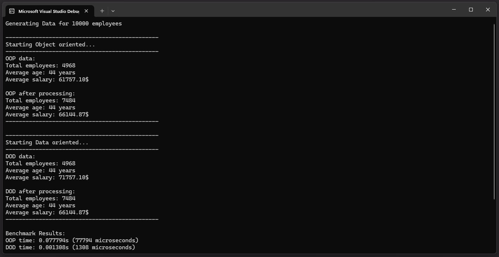
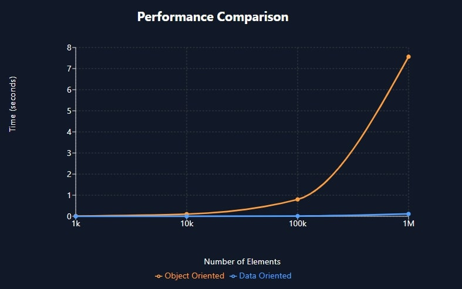

# Data-Oriented Experiment

Comparison between Object-Oriented and Data-Oriented design approaches using employee data processing as a case study.



## Overview
This project demonstrates the implementation and performance comparison of two different programming paradigms:
- Object-Oriented Programming (OOP): Traditional approach with encapsulated employee objects
- Data-Oriented Design (DOD): Memory-layout focused approach with separated data structures

## Features
- Employee data generation with customizable dataset size
- SIMD (Single Instruction Multiple Data) operations
- OpenMP parallelization
- Performance benchmarking

## Implementation Details
### Object-Oriented Approach
- Traditional class-based design
- Employee data encapsulated in objects
- Standard vector operations
- OpenMP parallel processing

### Data-Oriented Approach
- Separated numeric and textual data
- Cache-optimized data layout
- SIMD operations with OpenMP
- Batch processing with configurable batch size

## Usage
```cpp
// Initialize
Data dataGenerator;
ObjectOrientedMethod OOP;
DataOrientedMethod DOD;

// Generate test data
int dataSize = 10000;
std::vector<Data::Employee> baseData = dataGenerator.createEmployeeData(dataSize);

// Object-Oriented processing
std::vector<Data::Employee> empOver50k = OOP.GetEmployeeByIncome(baseData, 50000);
std::vector<Data::Employee> empWithRaise = OOP.IncreaseEmployeeSalary(baseData, 10000);

// Data-Oriented processing
DOD.PrepareData(baseData);
std::vector<size_t> dopEmpOver50k = DOD.GetEmployeeByIncome(50000);
DOD.IncreaseEmployeeSalary(10000);
```

## Performance Results

| Data Size | OOP Time (s) | DOD Time (s) | Speed Improvement |
|-----------|--------------|--------------|------------------ |
| 1,000     | 0.012951    | 0.000128      | 101x              |
| 10,000    | 0.104024    | 0.001329      | 78x               |
| 100,000   | 0.800339    | 0.012202      | 66x               |
| 1,000,000 | 7.563932    | 0.113272      | 67x               |

