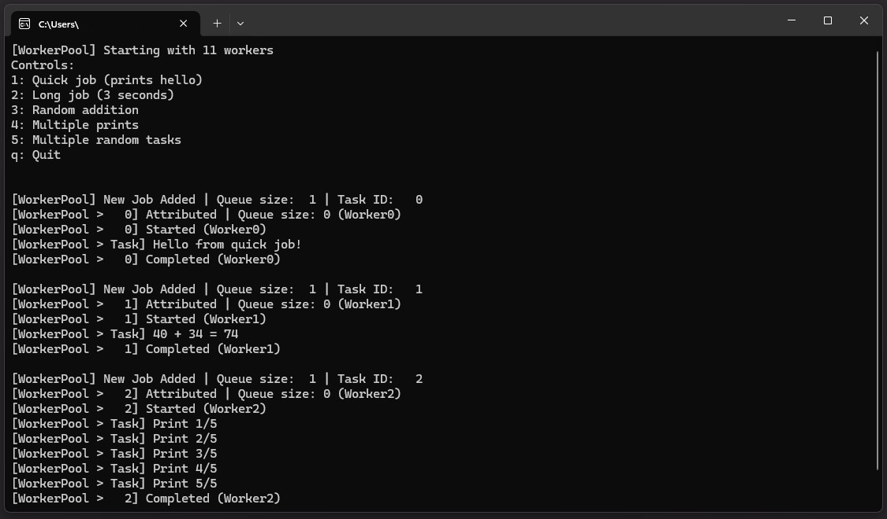

# GameDev-Experiments--Cpp-2025

This repository gathers various small-scale game development experiments and tests that are too small to have their own dedicated repository but are valuable for learning purposes. It serves as a centralized space to collect my different C++ learning tests and technical discoveries made during the year 2025.

## Projects

### WorkerPool
A lightweight C++ thread pool implementation for managing concurrent task execution.

### Shader-GLSL 
A small GLSL shader that generates two energy balls spinning around each other and blending when they intersect.

## Repository Structure

Each mini-project has its own folder at the root level, containing:
- A specific `README.md` file describing the project and documenting its usage
- The source files
