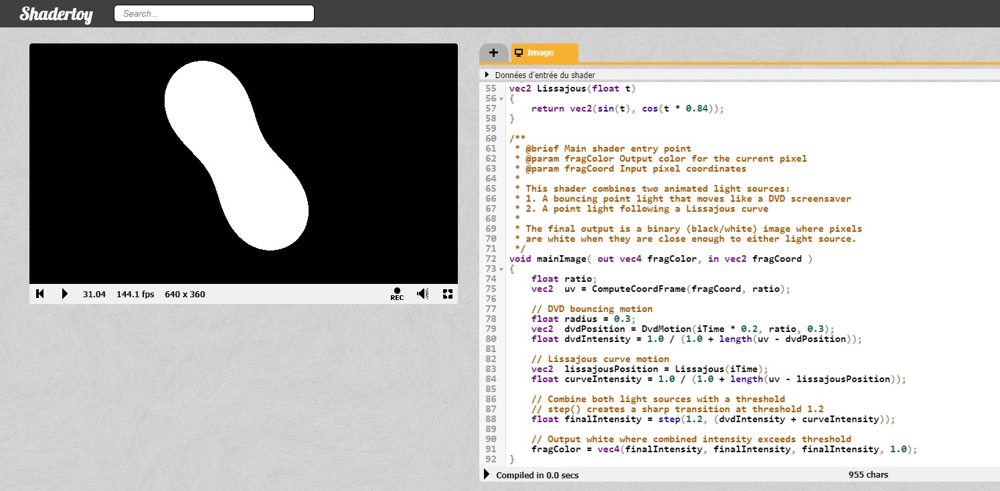

# Shader GLSL

A small shader in GLSL that generates two balls of energy that spin around each other and blend when they cross.

## Overview
This shader combines two animated point light sources:
- A bouncing light that moves like a DVD screensaver
- A light following a Lissajous curve

The final output is a binary (black/white) image where pixels are white when they are close enough to either light source. The intensities of the two lights are added together and a threshold is applied to create a sharp transition between black and white.

## Usage

To test this shader, simply copy the code from [DancingEnergyBalls.glsl](./DancingEnergyBalls.glsl) to [Shadertoy](https://www.shadertoy.com/new).

## Implementation Details
The shader code is organized into several functions:
- `triangularWave`: Creates a triangular wave pattern used for the bouncing motion
- `ComputeCoordFrame`: Sets up the UV coordinate frame with proper aspect ratio
- `DvdMotion`: Generates the bouncing DVD-like motion within screen boundaries
- `Lissajous`: Generates a Lissajous curve motion
- `mainImage`: The main shader entry point that combines the two light sources

The `mainImage` function calculates the positions and intensities of the two lights, adds them together, and applies a threshold using `step()` to create the final black and white output.